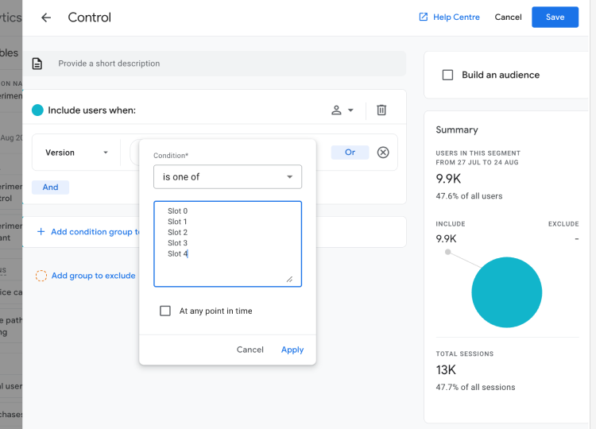
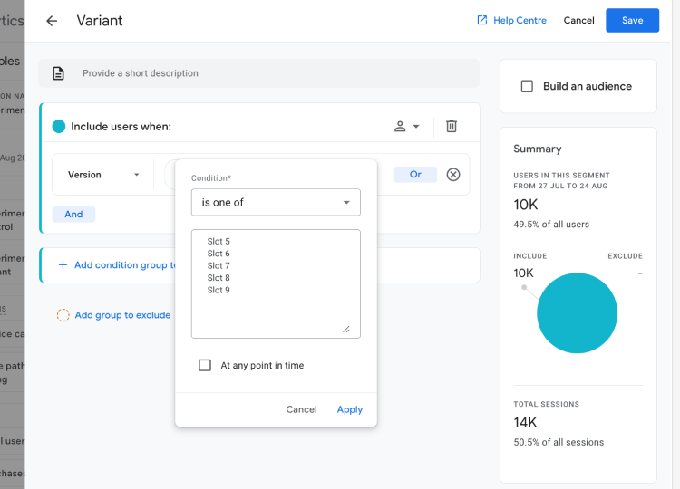
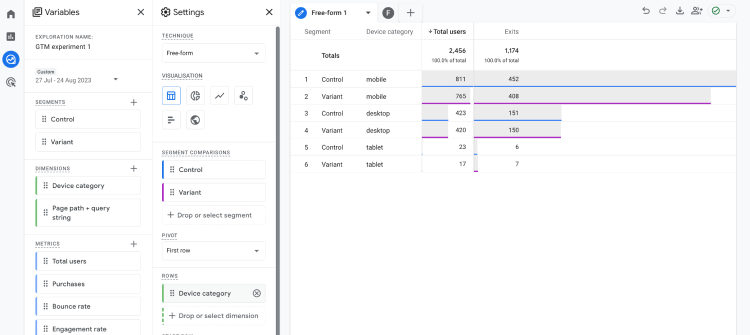

# Free form Google Analytics

The experiment's analysis will be conducted through the utilization of Google Analytics, employing the free form option for this purpose.

## Segments

1. Launch **Google Analytics**.
2. Go to the **Explore** section.
3. Generate a new **Blank form**.

### Control
1. Create the **control segment**.
2. Choose **User segment**.
3. Name the segment **Control**.

    | Field:         | Input:           |
    | ------------- |:-------------|
    | **Segment name**    | Control |
    | **Condition**   | Version      |
    | **Filter** | is one of   ```Slot 0 Slot 1 Slot 2 Slot 3 Slot 4```   |

    > Important! Ensure that each slot is placed on a separate row, as indicated by the placeholder.

    

4. Check **At any point in time**.
5. **Save and apply**.

### Variant
1. Create the **variant segment**.
2. Choose **User segment**.
3. Name the segment **Variant**.

    | Field:         | Input:           |
    | ------------- |:-------------|
    | **Segment name**    | Control |
    | **Condition**   | Version      |
    | **Filter** | is one of   ```Slot 5 Slot 6 Slot 7 Slot 8 Slot 9```   |

    > Important! Ensure that each slot is placed on a separate row, as indicated by the placeholder.

    

4. Check **At any point in time**.
5. **Save and apply**.
6. For **PIVOT** select **First column**



## Dimensions

Dimensions can be employed by selecting them. One commonly utilized dimension is **Device category**, which provides insights into the performance of experiments across different devices.

## Metrics 

Select the metrics that require analysis. For instance, consider **Total users** and **Purchases**. The data will be displayed in the form.

